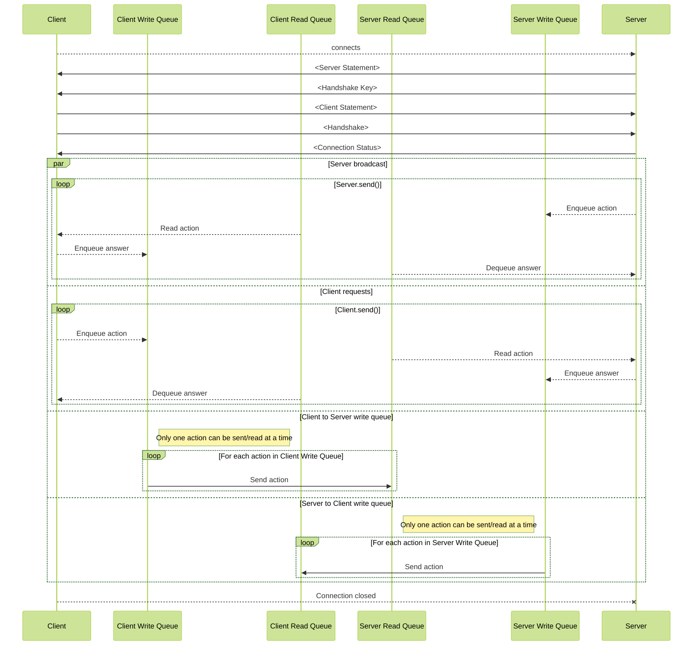
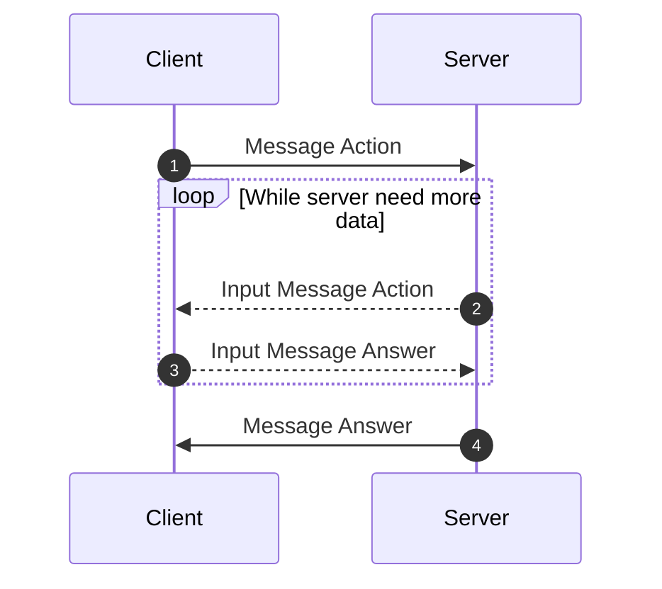

## Overview of data flow

```mermaid
%%{init: { 'theme': 'forest' } }%%
sequenceDiagram
    participant C as Client
    participant CWQ as Client Write Queue
    participant CRQ as Client Read Queue
    participant SRQ as Server Read Queue
    participant SWQ as Server Write Queue
    participant S as Server
    C-->>S: connects
    S->>C: <Server Statement>
    S->>C: <Handshake Key>
    C->>S: <Client Statement> 
    C->>S: <Handshake>
    S->>C: <Connection Status>
    par Server broadcast
        loop Server.send()
            S-->>SWQ: Enqueue action
            CRQ-->>C: Read action
            C-->>CWQ: Enqueue answer
            SRQ-->>S: Dequeue answer
        end
    and Client requests
        loop Client.send()
            C-->>CWQ: Enqueue action
            SRQ-->>S: Read action
            S-->>SWQ: Enqueue answer
            CRQ-->>C: Dequeue answer
        end
    and Client to Server write queue
        Note right of CWQ: Only one action can be sent/read at a time
        loop For each action in Client Write Queue
            CWQ->>SRQ: Send action
        end
    and Server to Client write queue
        Note right of SRQ: Only one action can be sent/read at a time
        loop For each action in Server Write Queue
            SWQ->>CRQ: Send action
        end
    end
    C--xS: Connection closed
```

## Input actions

```mermaid
sequenceDiagram
    autonumber
    participant C as Client
    participant S as Server
    C->>S: Message Action
    loop While server need more data
        S-->>C: Input Message Action
        C-->>S: Input Message Answer
    end
    S->>C: Message Answer
```